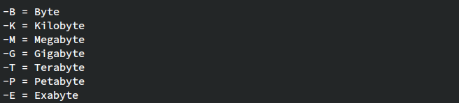
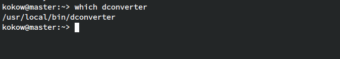
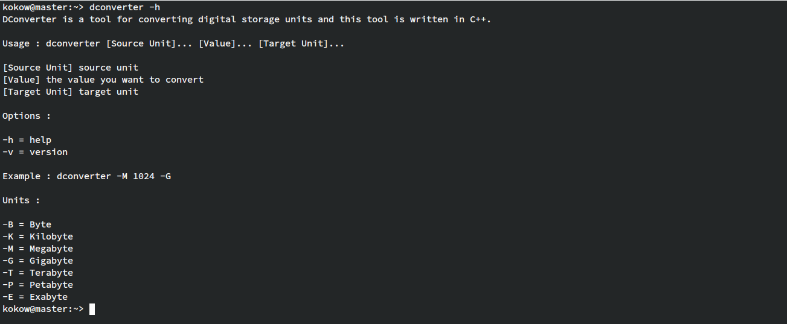
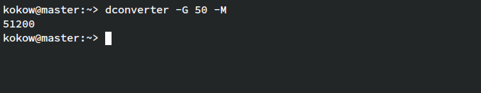
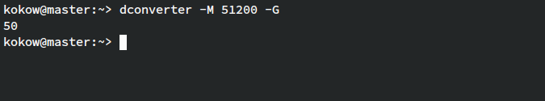

# DConverter

DConverter is a tool for converting digital storage units and this tool is written in C++. <br>
Case Example : You want to convert from Megabyte to Gigabyte. <br>


## Install
### Linux Distros
- Clone this repository
- Compile using command : 
```g++ dconverter.cpp -o dconverter```
- Move the compiled binary to `/usr/local/bin/` directory


- ## Usage
- Basics you should know
```dconvert [Option First Unit]... [Value]... [Option Target Unit]...```
- Help
```dconverter -h``` <br>


- Examples :
  - Convert from Gigabyte to Megabyte


- Convert from Megabyte to Gigabyte


Version : 1.0 <br>
written by Bagus Koko Wibawanto
